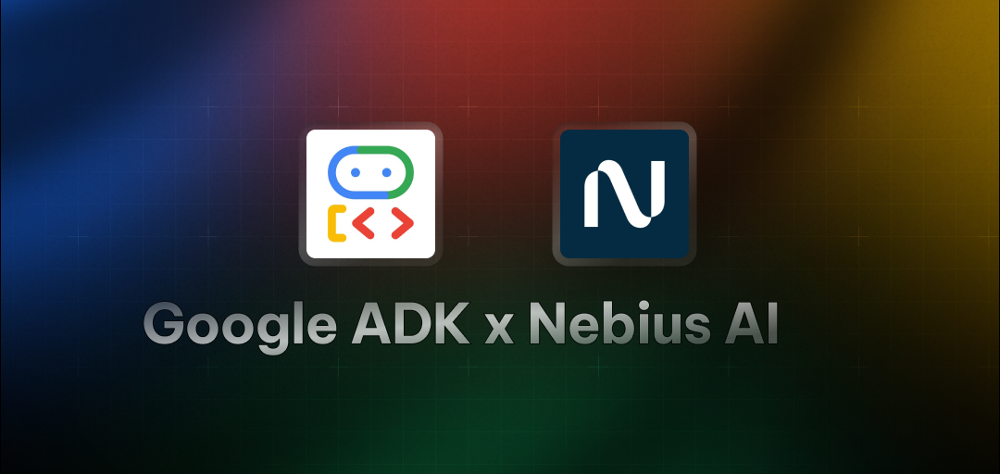

# Simple Tool Calling Agent with Google ADK (Agent Development Kit) + Nebius AI




This example shows a sample 'tool calling' agent, built using Google's Agent Development Kit (ADK) framework.

## References

- [Google Agent Development Kit (ADK)](https://google.github.io/adk-docs/)


## Prerequisites

- Nebius API key (get it from [Nebius AI Studio](https://studio.nebius.ai/))
- Python 3.10 or higher dev environment.


## Setup

**1 - get the code**

```bash
git   clone    https://github.com/nebius/ai-studio-cookbook/
cd  agents/google-adk-tool-calling
```
**2 - Install dependencies**

using `uv`

```bash
# create a venv and install dependencies
uv  sync
source   .venv/bin/activate

# Verify ADK installation
adk --version
```

Or install using python pip

```bash
pip install -r requirements.txt

# Verify ADK installation
adk --version
```

**3 - Create .env file**

Create a `.env` file in the project root and add your Nebius API key:

```bash
cp env.example .env
```

```text
NEBIUS_API_KEY=your_api_key_here
```


## Running the agent in CLI

Switch to project dir:

```bash
cd  agents/google-adk-tool-calling
```

**Using `uv`**

```bash
uv  sync
uv  run   adk run .
```

or 

```bash
uv sync
source   .venv/bin/activate
adk run .
```

**Using python pip**

```bash
adk run .
```

## Interacting with the Agent

Once the agent is running, we can try the following:

**Find out what the agent can do**

> What are your capabilities?

> What can you do?

**Ask the agent questions**

> What is $100 in EUR?

You should get answer like 

`The converted amount is 200 EUR`

Ask another:

> Convert $100 into AUD

Since the agent can only convert from USD --> EUR, you may get an answer like this

`I currently only support converting USD to EUR (Euro). Conversion to AUD (Australian Dollar) isn't available yet`

## ADK UI Runner

ADK has a [web ui](https://google.github.io/adk-docs/get-started/quickstart/#dev-ui-adk-web) that can show you details of agent's inner working.  This is a great tool for debugging.


Here is how to run the web ui.

**Go to parent dir** (This is important!)

```bash
# go project's parent directory
cd ..  

# and run
adk web
```

Go to URL : [localhost:8000](http://localhost:8000/)

**Select the agent from drop down list**

**And interact with the agent**

**Look at `Trace` and `Events` tabs**


## Dev Notes

**Preparing the dev env using UV**

```bash
cd agents/google-adk-tool-calling
uv init .
mv main.py   agent.py
uv  add -r requirements.txt
uv sync
```