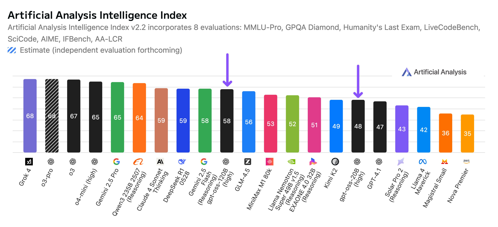
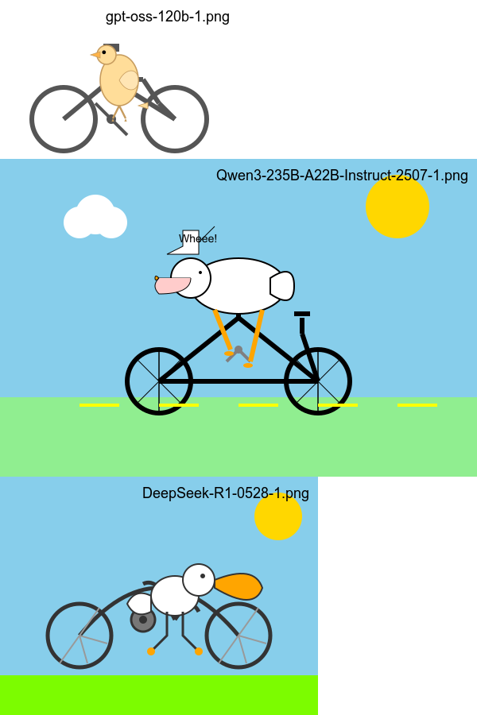

# GPT OSS has dropped!

**Published:** August 6, 2025

> ⭐ If you find this repo useful, give it a star! You’ll be notified of new updates and help others discover it too — thank you!

---

## Table of Contents

  - [Try it Out](#try-it-out)
  - [TL;DR](#tldr)
    - [🧠 Fun Facts](#-fun-facts)
  - [Performance and Benchmarks](#performance-and-benchmarks)
    - [Official benchmarks](#official-benchmarks)
    - [Artificial Analysis Benchmark](#artificial-analysis-benchmark)
    - [Fun Benchmark: "Pelican riding a bicycle"](#fun-benchmark-pelican-riding-a-bicycle-)
  - [References](#references)

## Try it Out

Run the model using this notebook:

📓 [gpt_oss_1.ipynb](qwen3_2507_1.ipynb)

## TL;DR

GPT OSS is a hugely anticipated open-weights release by OpenAI, designed for powerful reasoning, agentic tasks, and versatile developer use cases

- Two models: 
  - a big one with 117B parameters: [gpt-oss-120b](https://huggingface.co/openai/gpt-oss-120b)
  - A smaller one with 21B parameters:  [gpt-oss-20b](https://hf.co/openai/gpt-oss-20b)
- Both are mixture-of-experts (MoEs) and use a 4-bit quantization scheme (MXFP4), enabling fast inference (thanks to fewer active parameters)
  - **GPT‑OSS‑120B**: 36 layers, ~117B total parameters, but only ~5.1B parameters activated per token.  It uses 128 experts, with just 4 experts activated per token. 
  - **GPT‑OSS‑20B**: 24 layers, ~21B total parameters, ~3.6B active per token; 32 experts, 4 activated per token. 
- Reasoning, text-only models; with chain-of-thought and adjustable reasoning effort levels.
- Instruction following and tool use support.
- License: Apache 2.0, with a small complementary use policy.

### 🧠 Fun Facts

**OpenSource**

**GPT-OSS** is OpenAI's open source model release since GPT-2 (released in 2019).  That's over 6 years!

**Benchmark beaters**:

- **GPT‑OSS‑120B** rivals or outperforms OpenAI’s proprietary **o4‑mini** in coding (Codeforces), general knowledge (MMLU, HLE), and even exceeds on math (AIME) and health (HealthBench). 
- **GPT‑OSS‑20B**, despite its size, matches or surpasses **o3‑mini** on many benchmarks—and even shines in math and health tasks

## Performance and Benchmarks

### Official benchmarks

| 
|-

[See more here](https://openai.com/index/introducing-gpt-oss/)

### Artificial Analysis Benchmark

| 
|-

[AA's analysis](https://www.linkedin.com/pulse/independent-benchmarks-openais-gpt-oss-models-gpt-oss-120b-4ci5c/?trackingId=YVhoZxm8SyGr7QYd6KKP%2Bw%3D%3D)

[More from AA here](https://artificialanalysis.ai/models/gpt-oss-120b)

### Fun Benchmark: "Pelican riding a bicycle" 🪿🚲

Inspired by [Simon Willison](https://simonwillison.net/)'s fun experiment ([see here](https://simonwillison.net/tags/pelican-riding-a-bicycle/)), this benchmark is all about how well models generate quirky, imaginative responses.

You can see our full pelican tests [here](../fun/pelican-riding-bicycle/).

So how does gpt-oss do?  Let's see.

**gpt-oss-20b** 

| 
|-

**gpt-oss-120b** 

| 
|-

#### Comparing against other SOTA OS models

**gpt-oss-120b  vs qwen3-235B-2507 vs  deepseek-r1-0528**

|
|-

## References

- [OpenAI open models page](https://openai.com/open-models/)  |  [github   openai/gpt-oss](https://github.com/openai/gpt-oss)
- [Welcome GPT OSS, the new open-source model family from OpenAI!](https://huggingface.co/blog/welcome-openai-gpt-oss)
- Model card for 120B param model: [gpt-oss-120b](https://huggingface.co/openai/gpt-oss-120b)
- Model card for smaller 20B param model: [gpt-oss-20b](https://hf.co/openai/gpt-oss-20b)