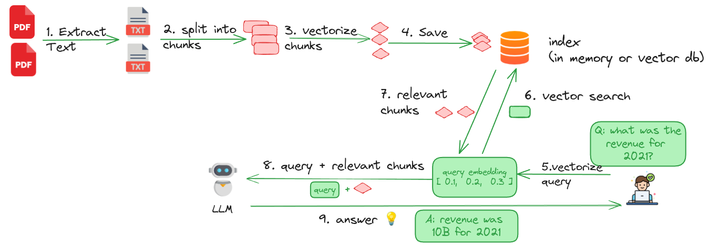

# End to End RAG Pipeline with Open Source Stack

This example demonstrates how to build a end-to-end RAG pipeline using open source stack.

## Features

- Parse complex PDF documents (100s of pages)
- Chunk them and calculate embeddings for chunks
- Efficient compute of embeddings using batch mode
- Store the calculated embeddings in a vector database for fast retrieval
- When user asks a question, the question and relevant document chunks are sent to LLM to get the answer

## Tech Stack

- Parsing PDF documents using [llama-index](https://docs.llamaindex.ai/en/stable/)
- Embedding model: [Qwen/Qwen3-Embedding-8B](https://huggingface.co/Qwen/Qwen3-Embedding-8B) - running on [Nebius AI Studio](https://studio.nebius.com/)
- Vector Database: [Milvus](https://milvus.io/)
- LLMs: open source LLMs - running on [Nebius AI Studio](https://studio.nebius.com/)

## Pre requisites

- Nebius API key.  Sign up for free at [AI Studio](https://studio.nebius.com/)


## RAG Workflow



## Step-1: Getting Started


**1. Get the code**

```bash
git   clone    https://github.com/nebius/ai-studio-cookbook/
cd    rag/rag-milvus-1
```

**2. Install dependencies:**

If using `uv` (preferred)

```bash
uv sync

source .venv/bin/activate
python -m ipykernel install --user --name=$(basename $(pwd)) --display-name "$(basename $(pwd))"
# select this kernel when running in jupyter / vscode
# see installed kernels
jupyter kernelspec list 
```

If using `pip`

```bash
python -m venv venv
source venv/bin/activate
pip install -r requirements.txt
uv run python -m ipykernel install --user --name=$(basename $(pwd)) --display-name "$(basename $(pwd))"
# select this kernel when running in jupyter / vscode
# see installed kernels
jupyter kernelspec list 
```

**3 - Create .env file**

Create a `.env` file in the project root and add your Nebius API key:

```bash
cp env.example .env
```

```
NEBIUS_API_KEY=your_api_key_here
```


## Step-2: Running the code


**Using UV**

```bash
uv run --with jupyter jupyter lab
```

**Using pip/Jupyter**

```bash
jupyter lab
```

And select the kernel defined above and run notebooks.

**Using vscode and other IDEs**

Restart vscode so it will refresh available kernels.  Then select it and run it.


## Step-3: Process PDFs

We will 
- parse PDF files 
- compute embeddings
- and store them into vector database

Run this notebook: [1_process_pdfs.ipynb](1_process_pdfs.ipynb)

## Step-4: Query PDFs

Use this notebook to query PDFs

Run this notebook: [2_query_pdfs.ipynb](2_query_pdfs.ipynb)


## Dev Notes

How the uv project was created.

```bash
uv init --python 3.11 .
uv add llama-index pymilvus openai  python-dotenv llama-index-vector-stores-milvus llama-index-embeddings-nebius   llama-index-llms-nebius
uv add --dev ipykernel   # for jupyter kernel
uv sync
# creating requirements.txt file
uv export --no-hashes --format requirements-txt --output-file requirements.txt
```